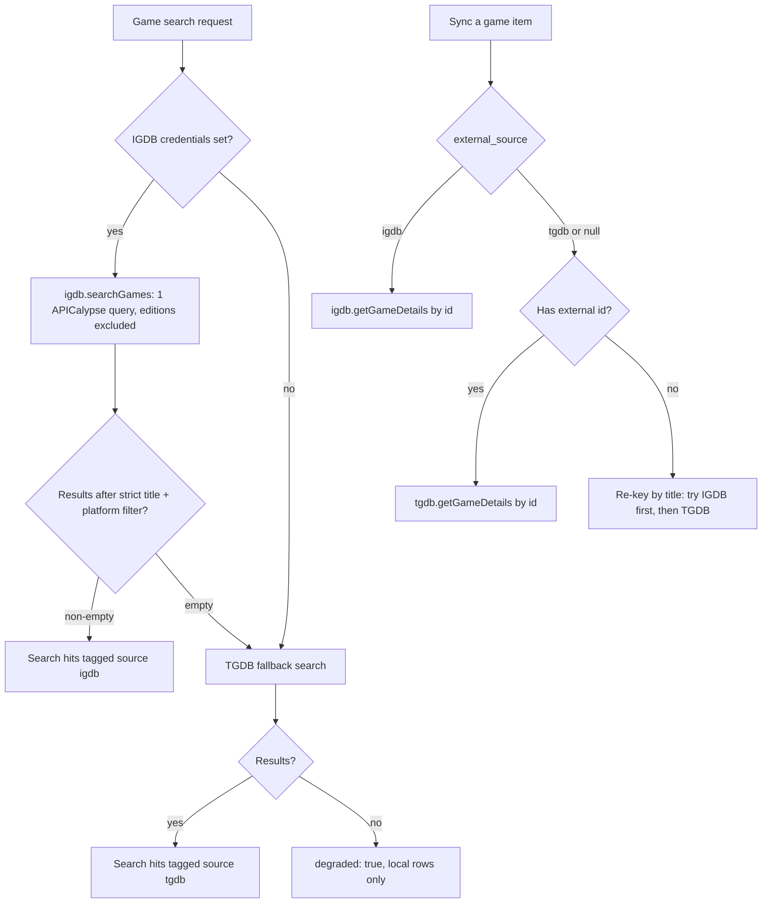

# IGDB game metadata provider

## 1. Goal

Add IGDB (https://api-docs.igdb.com) as the **primary** metadata provider for game media
items, with the existing TGDB provider kept as a **fallback**. Games newly created from
search will be IGDB-sourced; existing rows keep their source and sync per-row. An opt-in
backfill script re-keys existing games to IGDB ids by title.

## 2. Decisions (confirmed with user)

| Question | Decision |
| --- | --- |
| Provider priority | IGDB primary for new searches; TGDB fallback when IGDB is not configured or returns nothing. Both keys independent. |
| Existing games | Opt-in backfill script re-keys existing games (any source or local-only) to IGDB ids by title. On-demand re-key during sync prefers IGDB. |
| Field set | No new columns. Keep the existing 7-field set (overview, content_rating, players, coop, genres, developers, publishers). IGDB games store `players = NULL`, `coop = NULL`. |
| Schema | New migration extends the `external_source` CHECK constraint to include `'igdb'`. No other schema changes — the partial unique index `(user_id, media_type, external_source, external_id)` already allows `tgdb` and `igdb` rows for the same game to coexist. |

## 3. IGDB API facts (from api-docs.igdb.com)

- **Auth**: register a free Twitch app (Confidential client) → Client ID + Client Secret.
  Token: `POST https://id.twitch.tv/oauth2/token?client_id=...&client_secret=...&grant_type=client_credentials`
  → `{ access_token, expires_in (~60 days), token_type: 'bearer' }`.
- **Requests**: `POST https://api.igdb.com/v4/games` (or `/v4/multiquery`) with headers
  `Client-ID: <id>` and `Authorization: Bearer <token>`; body is APICalypse text, e.g.
  `search "Halo"; where version_parent = null; fields name,slug,summary,first_release_date,cover.image_id,platforms.name,genres.name,involved_companies,age_ratings; limit 25;`
- **Rate limit**: 4 requests/second (HTTP 429), max 8 concurrent requests, `limit` max 500.
- **Inlined expanders** — one query returns genres, platforms, involved_companies (with
  `developer`/`publisher` booleans + `company.name`), and age ratings. **No separate
  ByID name-resolution calls needed** (unlike TGDB's 3 extra batched calls).
- **Images**: `https://images.igdb.com/igdb/image/upload/t_{size}/{image_id}.jpg`
  (`t_cover_big` = 264×374, used for `image_url`).
- **Field renames in progress**: age ratings expose `organization` and `rating_category`
  (with `rating_category.rating` for the label, e.g. "E10+"). Use the new names.
- **Editions**: `where version_parent = null;` excludes remasters/editions/versions —
  matches the "same game" semantics of [`titleRelation()`](plugins/media/services/titleMatch.ts).
- Free for non-commercial use; local caching is explicitly encouraged.

## 4. Schema — migration `050_igdb_external_source.sql`

Drop and re-add the `external_source` CHECK constraint (verify the auto-generated
constraint name, expected `media_items_external_source_check`, via `\d media_items`):

```sql
ALTER TABLE media_items DROP CONSTRAINT media_items_external_source_check;
ALTER TABLE media_items ADD CONSTRAINT media_items_external_source_check
  CHECK (external_source IN ('tmdb', 'tgdb', 'hardcover', 'igdb'));
```

## 5. New provider module `plugins/media/services/igdb.ts`

Follows the [`tgdb.ts`](plugins/media/services/tgdb.ts) singleton pattern
(`export const igdb = { ... }`, methods take credentials, return `null` on missing
credentials or failure via `withDegradation`).

### 5.1 Supporting change in [`mediaApi.ts`](plugins/media/services/mediaApi.ts)

Add `externalFetchPostText<T>(url, textBody, headers)` alongside `externalFetchPostJson`
— same 15 s abort pattern, but sends `Content-Type: text/plain` (IGDB requires a plain
APICalypse body, not JSON). Token endpoint stays a local helper (it takes query-string
params, not a body).

### 5.2 Token cache

Module-level in-memory token (server is single-user; in-process is fine, consistent with
`ApiCache`):

- `tokenCache = { token: string | null, expiresAt: number }`.
- `getAccessToken(clientId, clientSecret)`: if cached and `expiresAt > now`, return it.
  Otherwise fetch the token (plain `fetch` + AbortController, 15 s timeout), cache with
  `expiresAt = now + (expires_in - 3600) * 1000` (1 h safety margin).
- On 401 from any query, drop the cached token once and retry with a fresh token.

### 5.3 Result shape

`IgdbGameResult` — same field names as [`TgdbGameResult`](plugins/media/services/tgdb.ts)
so server dispatch code is uniform. `players: null`, `coop: null` (IGDB has no equivalent).

### 5.4 Mapping (APICalypse row → result)

| Result field | IGDB source |
| --- | --- |
| `externalId` | `String(row.id)` |
| `title` | `row.name` |
| `releaseYear` | `first_release_date` (unix seconds) → year; fallback `release_dates[0].y` |
| `imageUrl` | `cover.image_id` → `…/t_cover_big/{id}.jpg` |
| `externalUrl` | `https://www.igdb.com/games/{row.slug}` |
| `platform` | first `platforms.name` |
| `overview` | `row.summary`, HTML tags stripped, `cleanStr` |
| `contentRating` | `age_ratings`: prefer `organization = 'esrb'` → `rating_category.rating`; fallback first non-empty rating label |
| `genres` | `genres.name[]` |
| `developers` | `involved_companies` where `developer = true` → `company.name` |
| `publishers` | `involved_companies` where `publisher = true` → `company.name` |

Query field list:
`id,name,slug,summary,first_release_date,release_dates.y,cover.image_id,platforms.name,genres.name,involved_companies,age_ratings`.

### 5.5 Methods

- `searchGames(clientId: string | null, clientSecret: string | null, query: string, platform?: string | null): Promise<IgdbGameResult[] | null>`
  - No credentials → `null`.
  - APICalypse: ``search "<escaped query>"; where version_parent = null; fields …; limit 25;``
    (escape embedded double quotes).
  - Post-process: keep only rows whose `normalizeTitle(name)` has
    `titleRelation !== 'none'` against the query (IGDB `search` also matches description
    text, which would flood results); exact matches first.
  - Platform filter: post-filter rows by `platforms.name` case-insensitive match; if the
    filter yields nothing, serve the unfiltered list (mirrors TGDB's "quirky platform
    string never blocks a match" fallback).
  - Cache via `ApiCache(1 h)` key `igdb:search:{platform ?? ''}:{query.toLowerCase()}`.
  - `withDegradation(…, null, 'IGDB game search "…"')`.
- `getGameDetails(clientId, clientSecret, gameId): Promise<IgdbGameResult | null>`
  - `where id = <id>; fields …;` → first row or `null`; cache key `igdb:game:{id}`.

Rate limiting: one request per search/details, one token request per ~60 days — well
under 4 req/s for this app's traffic; the shared `ApiCache` single-flight dedupe already
prevents bursts. No token-bucket needed.

## 6. Server wiring — [`plugins/media/server.ts`](plugins/media/server.ts)

1. **`SettingsKeys` + `getApiKeys()`** (~line 64): add `igdb_client_id`,
   `igdb_client_secret` to the interface, the `key IN (…)` list, and the result mapping.
2. **Search (`searchMedia`, ~line 461)** — game branch becomes:
   ```
   igdbCreds = keys.igdb_client_id && keys.igdb_client_secret
   found = igdbCreds ? await igdb.searchGames(id, secret, q, platform?) : null
   source = 'igdb'
   if (!found || found.length === 0) {
     const tg = await tgdb.searchGames(keys.tgdb_api_key, q)
     if (tg) { found = tg; source = 'tgdb' } else if (!found) found = null
   }
   if (!found) degraded = true
   ```
   `external.external_source` reflects whichever provider produced the rows. Search UI
   needs no change — [`MediaSearch.tsx`](plugins/media/ui/pages/MediaSearch.tsx) renders
   `hit.external_source` generically.
3. **`fetchSyncMetadata` (~line 832)** — add `external_source` to its item param; game
   case dispatches on it:
   - `'igdb'` → `igdb.getGameDetails(…)` (provider label `IGDB`).
   - `'tgdb'`/`null` → existing `tgdb.getGameDetails(…)` (label `TGDB`).
4. **`rekeyGameByTitle` (~line 784)** — try IGDB first when IGDB credentials exist:
   search by title, filter to strict `titleRelation` candidates, pick one with the
   shared `pickIgdbCandidate` (8.1, using the row's stored platform), owner check on
   `external_source = 'igdb'`, UPDATE sets `external_source = 'igdb'`,
   `external_url = https://www.igdb.com/games/{slug}`. If IGDB yields no strict match
   (or no credentials), fall through to the existing TGDB path.
5. **Sync route (~line 900)** — `hasKey` for games: IGDB creds present **or** TGDB key
   present. Update the "Could not find this game in TGDB by title" message to be
   provider-neutral ("…in a game database…").
6. **`settingsKeys` (~line 2336)** — add
   `{ name: 'igdb_client_id', type: 'string', label: 'IGDB Client ID (Twitch app)' }` and
   `{ name: 'igdb_client_secret', type: 'string', label: 'IGDB Client Secret (Twitch app)' }`.
   `legacySettingsKeys` unchanged (those keys never existed in old backups).

## 7. Client changes

- **[`plugins/media/ui/MediaSettings.tsx`](plugins/media/ui/MediaSettings.tsx)** — new
  "IGDB — video games (primary)" block in the Media Databases section: Client ID
  (text input) + Client Secret (password input), with a helper line linking to
  `https://dev.twitch.tv/console/apps` ("create a Twitch application; IGDB uses the
  Twitch app's Client ID / Client Secret — no redirect URL needed"). Update the
  TGDB block label to "TheGamesDB (TGDB) — video games (fallback)". Add both keys to
  `MediaPluginSettings`, load, and `save()`.
- **[`plugins/media/ui/pages/MediaDetail.tsx`](plugins/media/ui/pages/MediaDetail.tsx)** —
  cosmetic: comment/label "TGDB-sourced metadata" → "provider-sourced" (display is
  already generic; the sync banner uses `res.provider` dynamically).
- No changes to `MediaSearch.tsx` or `IntegrationsTab.tsx` (media keys live in the
  plugin's own settings tab).

## 8. Backfill script `plugins/media/scripts/backfill-games-to-igdb.ts`

Modeled on [`backfill-games-external-ids.ts`](plugins/media/scripts/backfill-games-external-ids.ts):

- Reads `igdb_client_id`/`igdb_client_secret` from **`plugin_settings`** (note: the older
  TGDB scripts still read the legacy `user_settings` table, which no longer holds keys —
  this script uses the current location).
- Targets all `media_type = 'game'` rows; skips rows already `external_source = 'igdb'`.
- Per row: `igdb.searchGames(title)` → strict-match candidates via
  [`titleRelation()`](plugins/media/services/titleMatch.ts) → pick one with
  `pickIgdbCandidate` (see 8.1) → owner check on
  `(user_id, 'game', 'igdb', id)` excluding the row itself → UPDATE
  `external_source = 'igdb'`, `external_id`, `external_url`, and
  `COALESCE`-fill metadata columns (same pattern as `rekeyGameByTitle`).
- Sequential with a 300 ms delay between IGDB calls (4 req/s budget).
- `--dry-run` flag; prints a summary (rekeyed / no-match / errors).
- Opt-in, run manually via `tsx` like the existing scripts; user runs it after code lands.

### 8.1 Candidate selection (confirmed with user)

Shared helper `pickIgdbCandidate(row, candidates)` used by both the backfill script
and `rekeyGameByTitle` so the two paths agree. `candidates` are IGDB search results
that already passed the strict [`titleRelation()`](plugins/media/services/titleMatch.ts)
filter (exact or edition only). Selection priority:

1. **Item platform match**: if the row has a `platform`, prefer candidates whose
   `platforms.name` list contains that platform (case-insensitive, allowing short
   names — e.g. stored `PS5` matches IGDB's `PlayStation 5`; a small alias map covers
   the common console names).
2. **Personal console history** (when no stored platform, or no candidate matched
   step 1): prefer candidates released on the user's consoles, in this priority
   order — `PC, PS5, PS4, PS3, PS2, PS1, Game Boy Color` — using the first console in
   the list that at least one candidate supports.
3. **Arbitrary fallback**: if still ambiguous, take the first candidate (IGDB search
   order) — a wrong but valid same-game id is acceptable over leaving the row
   unrekeyed.

The helper returns `null` only when there are no strict-title candidates at all.

## 9. Explicitly out of scope

- Storing `aggregated_rating` (critic score) — user chose to keep the existing field set.
- Trusting Yamtrack's `source = 'igdb'` media_ids again at import time (they remain
  local-only + re-keyed; re-validating them is a possible follow-up).
- TGDB removal or migration of TGDB-sourced metadata to IGDB outside the opt-in backfill.
- IGDB for non-game media types.

## 10. Test plan

- **New `plugins/media/tests/igdb.test.ts`** (mocked fetch, mirrors
  [`hardcover.test.ts`](plugins/media/tests/hardcover.test.ts) style):
  - Token: fetched once, reused before expiry, re-fetched after expiry, refreshed on 401.
  - `searchGames`: no credentials → `null`; query escaping; `version_parent` filter
    present; description-only hits filtered out by `titleRelation`; platform
    post-filter + unfiltered fallback; field mapping (cover URL, ESRB rating via
    `rating_category.rating`, developer/publisher split from `involved_companies`).
  - `getGameDetails`: single-row mapping; unknown id → `null`; network failure → `null`.
  - `pickIgdbCandidate`: platform match wins; console-priority order
    (PC > PS5 > PS4 > PS3 > PS2 > PS1 > GBC) applied when no stored platform match;
    arbitrary first-candidate fallback; empty candidates → `null`.
- **`plugins/media/tests/server.test.ts`**:
  - Update `settingsKeys`/`legacySettingsKeys` assertions (~lines 109–119) for the two
    new keys.
  - Search: IGDB configured + results → `external_source 'igdb'`; IGDB empty or
    unconfigured → TGDB fallback; both fail → `degraded: true`.
  - Sync: game with `external_source 'igdb'` → IGDB details; `'tgdb'` → TGDB details;
    local-only game re-key prefers IGDB.

## 11. Mermaid: game search + sync flow after the change


