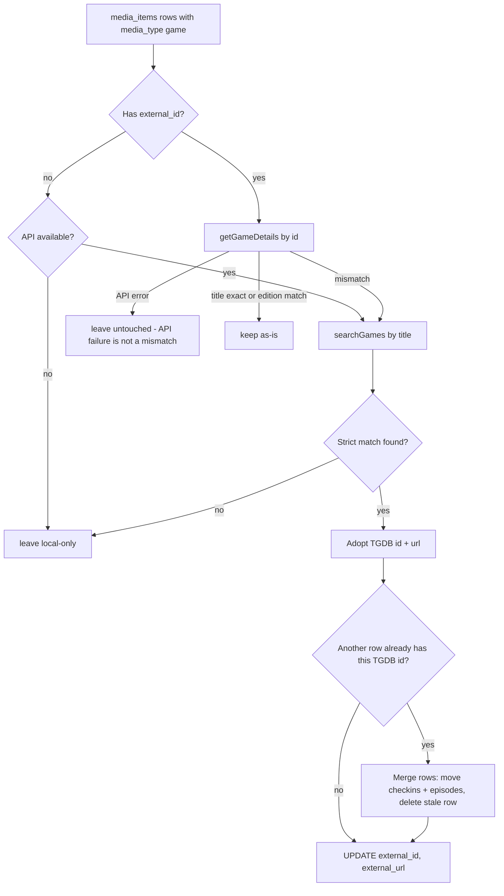

# Game metadata re-key: Yamtrack IGDB IDs → real TGDB IDs

## Context / root cause

Yamtrack stores games with `source='igdb'` and `media_id` = the **IGDB** numeric ID.
Our importer (`mapYamtrackSource` in `server/src/services/yamtrack.ts`) maps that to
`external_source='tgdb'` and builds `external_url` as `https://thegamesdb.net/game.php?id=<igdb id>` —
so every Yamtrack game row carries the wrong ID under the wrong provider label:

- Links point to the wrong / nonexistent TGDB page.
- `tgdb.getGameDetails()` metadata sync in `server/src/routes/media.ts` would silently
  overwrite title/image with a *different* game's data (or 404).
- Re-imports are idempotent on `(user_id, media_type, external_source, external_id)`,
  so re-importing the CSV cannot self-heal.
- Games-CSV-imported games (`server/src/db/import-games-csv.ts`) correctly hold real TGDB IDs;
  the two ID spaces currently coexist under one `external_source='tgdb'` label.

**Decision (user-approved):** Keep TGDB as the provider. Re-key wrong IDs via
title+platform verification and re-resolution. Deliver data repair as a one-off CLI
backfill script (needs API calls + rate limiting). Fix the Yamtrack importer so it
never again trusts the `igdb` media_id as an external ID.

## Approach overview

Strict match = same rules as the games-CSV importer: `normalizeTitle()` +
`titleRelation()` exact/edition only (sequels/subtitles never match).

## Work items

### 1. One-off CLI: `server/src/db/backfill-games-external-ids.ts`

Modeled on `import-games-csv.ts` (reuse its exported `normalizeTitle`, `titleRelation`,
rate-limiting pattern: 500ms delay, abort after 3 consecutive API failures, and the
`/v1/API/Limit` allowance check up front).

- Usage: `npm run backfill:games-external-ids` and `--dry-run`.
- Loads `tgdb_api_key` from `user_settings`; with no key, the script can only
  re-resolve local-only rows via name search if the user passes `--no-key` (optional;
  default: exit with a message).
- For **every** game `media_items` row (covers Yamtrack rows and games-CSV rows uniformly):
  1. **Has external_id:** `tgdb.getGameDetails(id)`.
     - API error/null → leave untouched (a failure is NOT evidence of a wrong ID).
     - `titleRelation(stored.title, fetched.title)` is `exact` or `edition` → verified, keep.
     - Otherwise → mismatch → re-resolve.
  2. **Re-resolve:** `tgdb.searchGames(title)`; pick the first strict match
     (exact, then edition) using the same selection logic as
     `pickBestTgdbMatch` in `import-games-csv.ts`.
  3. **Adopt:** set `external_id`, `external_url = 'https://thegamesdb.net/game.php?id=<id>'`,
     plus `release_year` / `image_url` / `platform` from the fetched data (only if the
     columns are currently NULL or clearly stale — prefer refresh from the same call).
  4. **Merge guard:** before adopting an id, check the partial unique index
     `idx_media_items_external`. If another row already owns
     `(user, game, 'tgdb', id)`: move its `media_checkins` and `media_tv_episodes`
     rows to the survivor, delete the stale row. The survivor is the row that
     already had the correct id (the one being merged *into*).
  5. **No strict match found:** leave the row untouched and print it in a report
     (manual review). Do NOT null out IDs on ambiguity.
- Dry-run prints the per-row plan (verified / re-keyed / merged / unresolvable / api-failed)
  with old → new IDs, and writes nothing.
- Idempotent: a second run finds every row verified and makes no changes.
- Print a final summary + the unresolvable list at the end.

### 2. Wiring

- `server/package.json`: add `"backfill:games-external-ids": "tsx src/db/backfill-games-external-ids.ts"`.
- Header comment documents usage + "back up the database before the first real run".

### 3. Yamtrack importer: stop trusting the `igdb` media_id

- `server/src/services/yamtrack.ts` `mapYamtrackSource()`:
  - `case 'igdb':` → return `null` (games become local-only at import).
  - `case 'tgdb':` stays → `'tgdb'` (forward-compatible if Yamtrack ever labels
    games as TGDB-sourced).
- `server/src/routes/import-yamtrack.ts` `upsertMediaItemWithClient()`:
  - The `external_url` ternary keeps its tmdb/hardcover branches; the `tgdb` branch
    stays only reachable for genuine `'tgdb'`-sourced rows.
  - **New:** when `external_source` is null (local-only game), find-first by
    normalized title (`normalizeTitle` + `titleRelation` exact/edition, same logic
    as `matchLocalGame` in `import-games-csv.ts`) so re-imports don't create
    duplicate game rows. This mirrors the board-game local-only behavior in
    `server/src/routes/media.ts`.
  - Note: `media_checkins` dedupe is unaffected — `external_event_id` still comes
    from the CSV row, so re-imports remain idempotent.
- Consequence: future Yamtrack game imports create local-only game items; enrichment
  happens via item 4 (on-demand sync) or the backfill script.

### 4. On-demand re-key fallback in metadata sync

- `server/src/routes/media.ts` `syncMetadata` (game branch, ~line 491):
  - If the item has no `external_id` but `keys.tgdb_api_key` is set:
    `tgdb.searchGames(title)` → first strict match → update the item in place
    (`external_id`, `external_url`, `release_year`, `image_url`, `platform`) and
    return that metadata. This is what makes Yamtrack-imported games self-heal the
    first time a user opens their detail page / hits sync.
  - Keep the existing 400 for local-only rows with *no* API key (board-game behavior).

### 5. Tests

- `server/tests/services/yamtrack.test.ts`:
  - `mapYamtrackSource('igdb')` → `null`; `mapYamtrackSource('tgdb')` → `'tgdb'`.
  - Update existing plan tests where games previously expected `external_source='tgdb'`.
- New `server/tests/routes/` or services test for the importer: local-only game rows
  upsert by title (second import of the same title finds the existing row, no new
  `media_items` row) — can use the integration test harness in `server/tests/helpers/testDb.ts`.
- Backfill decision logic (verify / mismatch / re-resolve / merge-guard / no-match)
  extracted into exported pure helpers in the backfill file, unit-tested with mocked
  `tgdb` calls (same style as `server/tests/services/tgdb.test.ts`).

### 6. Run the backfill (user step, after code lands)

1. Back up the DB (Settings → backup export, or `pg_dump`).
2. `npm run backfill:games-external-ids -- --dry-run` — review the plan, especially
   the unresolvable list.
3. `npm run backfill:games-external-ids` — apply.
4. Spot-check a few Yamtrack games in the UI: link resolves, sync shows correct data.

## Explicitly out of scope

- No migration needed: `external_source` already allows `'tgdb'`/null for games,
  and no schema change is required.
- No IGDB integration, no new settings key, no client changes (UI already shows
  "TGDB" and renders `external_url` as stored).
- `backfill-tgdb-external-urls.ts` stays as-is (idempotent, harmless) but is NOT
  re-run before the re-key (it only rewrites URLs from whatever id is stored).
