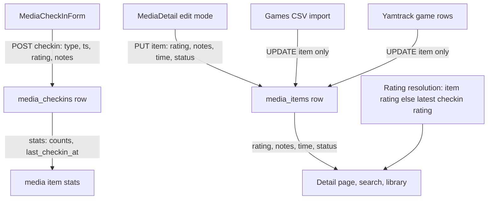

# Media-Item-Level Metadata — Architecture & Plan

## 1. Problem

`rating`, `notes`, `time_played_minutes`, and `raw_score` live only on [`media_checkins`](server/src/db/migrations/033_media_checkins.sql:46). The media item's "my rating", "notes", and "total time played" are **derived** by aggregating check-ins (e.g. `ARRAY_AGG(rating ORDER BY checked_in_at DESC)[1]` in [`routes/media.ts`](server/src/routes/media.ts:450)). This makes item-level metadata impossible to set independently of an event, and forces synthetic "completed" check-ins to be manufactured by the games CSV import.

## 2. Decisions (confirmed with user)

1. `rating`, `notes`, `time_played_minutes` (games), and `raw_score` become **columns on `media_items`**.
2. The same columns **stay on `media_checkins`** for per-episode/per-session context, but are **no longer aggregated** into the item display for games.
3. `media_checkins.checkin_type` stays the source of truth for stats (`completed_count`, timeline) for **all** media types.
4. **Both game import paths create zero check-ins**: the games CSV import **and** the Yamtrack game rows. Both write rating/notes/time/status onto the `media_items` row.
5. A new nullable `status` column is added to `media_items` (`completed`/`in_progress`/`started`/`dropped`) — editable from the item detail page's edit mode, set by the game importers when status data is present.
6. The check-in form **keeps** score + notes (recorded on the check-in row) but **loses** the total-time-played field. Submitting a check-in **never** updates item-level rating/notes.
7. Rating / notes / time-played / status are shown on the media detail page and edited there in **edit mode** (which already exists for item metadata).
8. **Display rating resolution (all media types):** whenever the server needs "the rating of this item" (item endpoints, search, sorting by rating, "highest rated" lists, stats), it returns `media_items.rating` when non-NULL, otherwise the **latest check-in's rating** (`ORDER BY checked_in_at DESC, id DESC`). One shared query fragment/helper so every call site agrees.
9. **No backfill**: the migration adds the columns but does *not* copy values from existing check-ins. Existing items start with NULL item-level fields and immediately fall back to the latest-checkin rating via rule 8.

## 3. Schema — migration `040_media_items_metadata.sql`

```sql
ALTER TABLE media_items
  ADD COLUMN IF NOT EXISTS rating SMALLINT CHECK (rating IS NULL OR (rating >= 0 AND rating <= 4)),
  ADD COLUMN IF NOT EXISTS raw_score NUMERIC(4,2),
  ADD COLUMN IF NOT EXISTS notes TEXT,
  ADD COLUMN IF NOT EXISTS time_played_minutes INTEGER CHECK (time_played_minutes IS NULL OR time_played_minutes >= 0),
  ADD COLUMN IF NOT EXISTS status TEXT CHECK (status IN ('completed','in_progress','started','dropped'));

CREATE INDEX idx_media_items_rating ON media_items(user_id, rating) WHERE rating IS NOT NULL;

-- Synthetic games-CSV check-ins are now redundant (their data lives on the
-- item) and would keep inflating completed_count — remove them.
DELETE FROM media_checkins WHERE external_event_id LIKE 'ggbl:%';
```

Notes:
- **No backfill** (per user decision): existing items start with NULL `rating`/`raw_score`/`notes`/`time_played_minutes`; display falls back to the latest check-in rating (rule 8) so nothing visually regresses. `status` is NULL until set by the user or a re-import.
- The games-CSV synthetic check-ins (`external_event_id LIKE 'ggbl:%'`) are **deleted** in the same migration.

## 4. Server changes

### 4.1 [`routes/media.ts`](server/src/routes/media.ts)
- **Shared rating-resolution helper** (e.g. `resolveItemRating(itemId)` or a SQL fragment): `SELECT mi.rating FROM media_items mi WHERE mi.id=$1` → if NULL, `(ARRAY_AGG(mc.rating ORDER BY mc.checked_in_at DESC, mc.id DESC) FILTER (WHERE mc.rating IS NOT NULL))[1]` from check-ins. Used by every call site that displays/sorts by "the" rating of an item.
- `GET /items/:id` + `PUT /items/:id` + `GET /search` result shape: replace the aggregated `my_rating` / `total_time_played_minutes` with the item's own `rating`, `raw_score`, `notes`, `time_played_minutes`, `status`, plus the resolved display rating (item rating else latest check-in rating) for **all** types. Keep `last_checkin_at`, `checkin_count`, `completed_count` (still from check-ins).
- `PUT /items/:id`: accept `rating` (0–4 int or null), `raw_score` (number or null), `notes` (string or null), `time_played_minutes` (int ≥ 0 or null — manual edit **may** decrease; the never-decrease clamp applies only to import), `status` (one of the three, or null).
- `POST /items/:id/checkins` + `PUT /checkins/:id`: keep `rating`/`raw_score`/`notes`/`time_played_minutes` fields on the check-in row, but **remove** the "clamp to current total" logic (the `Math.max(existing, submittedTime)` block at [media.ts:700-715](server/src/routes/media.ts:700)) — time is now item-level, so per-row time is plain session context.
- `GET /stats` ([media.ts:1080](server/src/routes/media.ts:1080)) and any sort-by-rating: use the shared rating-resolution (item rating else latest check-in rating).

### 4.2 [`db/import-games-csv.ts`](server/src/db/import-games-csv.ts)
- Parse an optional `Status` column (`completed`/`in progress`/`started`/`dropped`). If absent, default: rating or playtime present → `completed`, else `in_progress`.
- Per row: find-or-create the `media_items` row (title/external matching unchanged), then `UPDATE media_items SET rating, raw_score, notes, time_played_minutes = GREATEST(COALESCE(time_played_minutes,0), $csv), status WHERE ...`. The never-decrease rule now applies at item level.
- **No `media_checkins` inserts at all.** `checkinEventId`/`ggbl:` prefix removed; idempotency is now simply "the item row already exists" (UPDATE is inherently idempotent; re-running only raises time and re-enriches).
- `loadLocalGames` reads `time_played_minutes` from `media_items` directly (drop the `LEFT JOIN LATERAL` over check-ins).
- Stats/labels updated: drop `checkinsCreated`/`checkinsSkipped`, report `itemsUpdated`, `timeRaised`, `statusSet`.

### 4.3 [`routes/backup.ts`](server/src/routes/backup.ts)
- Export + restore the five new `media_items` columns (both directions, with the same type-coercion helpers used for existing INT/TEXT columns).

### 4.4 [`routes/timeline.ts`](server/src/routes/timeline.ts)
- No change: timeline cards are check-in events; `media_rating` there remains the event's rating.

### 4.5 [`services/yamtrack.ts`](server/src/services/yamtrack.ts) + [`routes/import-yamtrack.ts`](server/src/routes/import-yamtrack.ts) — game rows
- Classifier: game rows no longer produce `create_checkin` plans (both the progress>0 "in-progress check-in" path at [yamtrack.ts:346-369](server/src/services/yamtrack.ts:346) and the status-based path at [yamtrack.ts:371-433](server/src/services/yamtrack.ts:371) when `media_type = 'game'`). They produce a new disposition, e.g. `update_game_item`, carrying the values to write:
  - `rating` = `scoreToRating(row.score)`, `raw_score` = parsed score, `notes` = row notes
  - `time_played_minutes` = `parseProgressMinutes(row.progress)` (when > 0)
  - `status` = mapped `row.status` (`completed`/`in_progress`/`started`/`dropped`); when no status but progress > 0 → `in_progress`; otherwise NULL (leave item status untouched)
- Executor (`executeYamtrackImport`): for `update_game_item` plans, upsert the media item (unchanged) then `UPDATE media_items SET rating = $, raw_score = $, notes = $, status = COALESCE($, status), time_played_minutes = GREATEST(COALESCE(time_played_minutes,0), $) WHERE time IS NOT NULL ...` — plain SET for rating/notes/status (last import wins, idempotent on re-import), never-decrease for time. No check-in insert, no `external_event_id`.
- `countPlans`/preview UI ([`YamtrackImportSection.tsx`](client/src/pages/settings/YamtrackImportSection.tsx)): add the new disposition to counts and the per-row disposition table (replacing the old "creates an In-Progress check-in" reasons).
- TV/movie/book Yamtrack rows are **unchanged** — they still create check-ins with per-event rating/notes/time.

## 5. Client changes

- [`types/index.ts`](client/src/types/index.ts): `MediaItem` gains `rating`, `raw_score`, `notes`, `time_played_minutes`, `status` (+ keep `my_rating` for non-game types). `MediaCheckin` unchanged.
- [`MediaCheckInForm.tsx`](client/src/pages/media/MediaCheckInForm.tsx): remove the total-time-played hour/minute fields, the `timeBelowCurrent` warning, and the `totalMinutes` compute; stop pre-filling from item totals. Keep score + notes.
- [`MediaDetail.tsx`](client/src/pages/media/MediaDetail.tsx):
  - Display block: games show `item.rating`/`item.time_played_minutes`/`item.status`; non-games keep showing `my_rating` (latest check-in) for the header star row.
  - Edit mode: add rating (Stars/ScorePicker), notes (textarea), time played (games only), and status dropdown fields to the existing edit form; `PUT /media/items/:id`.
- [`MediaSearch.tsx`](client/src/pages/media/MediaSearch.tsx) + [`MediaLibrarySection.tsx`](client/src/components/MediaLibrarySection.tsx): read `rating`/`time_played_minutes` straight off the item (API shape change from §4.1).
- [`MediaTab.tsx`](client/src/components/MediaTab.tsx): "games completed" stat continues to count check-ins per decision §2.3; no change.

## 6. Test plan
- Server: migration test (`ggbl:` rows deleted, columns present, no backfill — existing items have NULL item-level fields); `PUT /items/:id` validation for the new fields (bad rating, negative time, bad status); rating-resolution helper (item rating wins, fallback to latest check-in, NULL when neither); games-CSV import dry-run + import tests: no check-ins created, time never decreases, status mapping incl. missing-Status-column default; Yamtrack game-row classifier + executor tests: no check-ins created, item fields written, time never decreases, status mapping, re-import idempotency.
- Client: `MediaCheckInForm` renders no time field; `MediaDetail` edit mode round-trips the new fields.

## 7. Mermaid: data flow after the change


