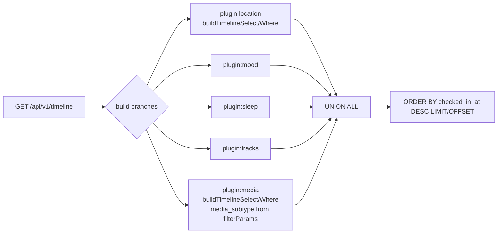
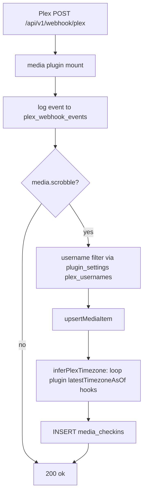

# Media check-in → plugin migration

Goal: the Media check-in type **including Media Items and Media Lists** lives entirely in
`plugins/media/`. After the migration, no media-check-in-related code remains in the core
platform (server, client, shared). Follows the Mood/Sleep/Tracks/Location precedent:
**custom storage** — the pre-existing tables (`media_items`, `media_checkins`,
`media_lists`, `media_list_items`, `media_tv_episodes`, `plex_webhook_events`) stay as-is;
only the code moves.

## Decisions (confirmed with user)

1. **Custom storage, tables unchanged.** The Media plugin keeps its existing tables and its
   existing API URLs (`/api/v1/media/*`, `/api/v1/webhook/plex`). The plugin declares them
   as `api` mounts, so no URL changes and no data migration. (This mirrors Sleep, which
   kept `/api/v1/webhook/sleep-as-android` as a plugin mount.)
2. **Plex webhook moves into the plugin** (Sleep precedent). The core route file
   `server/src/routes/webhook-plex.ts` is deleted. Timezone inference uses the new
   `latestTimezoneAsOf` hook the plugin implements, replacing the hard-coded
   `media_checkins` query in the core.
3. **Media API keys + `plex_usernames` move to `plugin_settings`** (media plugin
   `settingsKeys`), with a data migration from `user_settings`. The TMDB/IGDB/Hardcover key
   fields and the Plex section leave the core `settings` route and the core
   IntegrationsTab and become a Media `settingsSection` component in the plugin.
4. **Start-over "All Media" checkbox becomes plugin-driven**: maps to
   `delete_media_checkins` → the framework's `deletePluginData` → the plugin's
   `deleteUserData` hook, which deletes check-ins, list items, cached episodes, items,
   lists (and the plex event log).
5. **Legacy backups** (predating `backup.data.plugins`) are restored via the plugin's
   `restoreLegacyBackup` hook claiming `['mediaItems','mediaCheckins','mediaLists',
   'mediaListItems']`. The core keeps only the generic claimed-key skip (same as the
   mood/sleep precedent — see the "retiring restoreLegacyBackup" note in
   `plans/plugin-authoring.md`).

## Plugin structure

```
plugins/media/
  manifest.ts        id 'media', version '1.0.0'
                     filterParams: ['media_subtype']
                     fields: [media_item_id (text, required), media_type (text),
                              checkin_type (enum), rating (rating 0-4),
                              raw_score (number), season/episode (int+text),
                              time_played_minutes (int), notes (textarea)]
                     strings: { title 'Media', singular 'media check-in',
                                plural 'media check-ins',
                                newCheckIn 'What are you watching/reading/playing?',
                                profileTab 'Media',
                                confirmDelete 'Delete this media check-in?' }
  server.ts          storage: 'custom'
    api mounts:
      /media          (all of routes/media.ts: /search, /items*, /checkins/:id,
                      /tv/:id/seasons, /library, /stats, /lists*)
      /webhook/plex   (routes/webhook-plex.ts, incl. GET /stats)
    hooks:
      buildTimelineSelect / buildTimelineWhere
        (moved from the hard-coded 'media' branch in routes/timeline.ts;
         media_subtype scoping moves into buildTimelineWhere via filterParams)
      backupExport/backupImport  (items → check-ins → lists → list items;
         idempotent ON CONFLICT (id) DO NOTHING inserts)
      extraBackupTables: mediaLists, mediaListItems   (order: items → 'primary'
         (check-ins) → mediaLists → mediaListItems, plus media_tv_episodes is
         cache-only and NOT backed up, matching current behavior)
      legacyBackupKeys + restoreLegacyBackup  (import the 4 legacy loops from
         routes/backup.ts, including the toStatusOrNull/toIntOrNull/
         toStringArrayOrNull coercion helpers)
      deleteUserData (check-ins, list items, tv episodes, items, lists,
         plex_webhook_events)
      resetSettings  (not needed — keys move to plugin_settings, which the
         framework wipes)
      reflectionBranch (media rows in the "this day in previous years" query,
         with media_type/title/image/etc. in the `data` jsonb column)
      earliestDate   (MIN(DATE(checked_in_at AT TIME ZONE COALESCE(checkin_timezone,'UTC'))))
      resolveTimestamps (SELECT id, checked_in_at FROM media_checkins WHERE id = ANY($1::uuid[]))
      latestTimezoneAsOf (SELECT checkin_timezone ... ORDER BY checked_in_at DESC LIMIT 1;
         used by the plugin's own Plex webhook)
      llm            (gather media check-ins, toLines: date — type: title (S#E#, rating))
      reconcile      (scanAll: false — media-style "only missing/UTC labels";
         detailPath: /media/<segment>/<itemId>/<slug>; loadCheckins: join
         media_items for title; apply: label-only UPDATE of checkin_timezone)
      settingsKeys   [tmdb_api_key, hardcover_api_key,
                      plex_usernames] (all type 'string')
  services/          mediaApi.ts, tmdb.ts, igdb.ts, hardcover.ts, titleMatch.ts
                     (moved from server/src/services/; pure external-API code)
  tests/
    server.test.ts         (unit: buildTimelineWhere/Select, reconcile hook,
                            backup order, manifest validity)
    api.integration.test.ts (moved from server/tests/integration/media.integration.test.ts)
    backup-roundtrip.test.ts (moved from server/tests/integration/backup-media-roundtrip.test.ts;
                            now asserts restore goes through plugins.media payload,
                            plus a legacy-backup restore case via restoreLegacyBackup)
    plex-webhook.integration.test.ts (moved from server/tests/integration/)
    services/  (mediaApi/tmdb/igdb/hardcover/gamesRekey? no — gamesRekey stays core?
                see Core changes)
  ui/
    MediaCheckInLanding.tsx, MediaSearch.tsx, MediaCheckInForm.tsx,
    TvEpisodePicker.tsx, TvEpisodeCheckInForm.tsx, MediaDetail.tsx   (moved from
        client/src/pages/media/)
    MediaCard.tsx   (timeline card; from client/src/components/MediaCard.tsx)
    MediaFilter.tsx (Home filter section; from client/src/components/filters/MediaFilter.tsx)
    MediaTab.tsx    (profile tab; from client/src/components/MediaTab.tsx)
    MediaLibrarySection.tsx (moved)
    MediaIntegrationsSettings.tsx (TMDB/IGDB/Hardcover keys + Plex section; the
        media part of the current IntegrationsTab)
    YamtrackImportSection.tsx (Data settings section; from
        client/src/pages/settings/YamtrackImportSection.tsx)
    api.ts  (media + plexWebhook + yamtrack client methods, moved from
             client/src/api/client.ts)
    types.ts (MediaItem, MediaCheckIn, MediaList, Yamtrack* types, moved from
             client/src/types/index.ts)
  utils/
    media.ts (MEDIA_SUBTYPES, CHECKIN_TYPE_LABELS, detailPath, formatTimePlayed,
              iso<->datetime helpers; from client/src/utils/media.ts)
```

## Core framework changes

All changes below are in `server/` + `client/` core:

1. **[`server/src/plugins/registry.ts`](server/src/plugins/registry.ts)** — register the
   media plugin (import + entry).
2. **[`server/src/routes/timeline.ts`](server/src/routes/timeline.ts)** — delete the
   hard-coded `builtInWhereBuilders.media` / `builtInSelects.media` branches and the
   `media`/`plugin:` key logic; every branch now comes from a plugin. The
   `media_subtype` filter flows through the media plugin's declared `filterParams`.
3. **[`server/src/services/timestampReconciliation.ts`](server/src/services/timestampReconciliation.ts)** —
   delete `loadMediaCheckins`, the `mediaRows` special case, `buildMediaDetailPath`, and
   the `update.type === 'media'` branches. Media participates purely through its
   `reconcile` hook (`scanAll: false` preserves the "only missing/UTC labels" scan).
4. **`server/src/routes/webhook-plex.ts`** — deleted (moved to plugin).
5. **[`server/src/routes/backup.ts`](server/src/routes/backup.ts)** — delete the media
   export SELECTs, the 4 legacy import loops (+ their `Backup*` interfaces and coercion
   helpers), and the start-over `delete_media_items` block. Start-over:
   `delete_media_items` option value → treated as `delete_media_checkins` (legacy alias,
   matching the `delete_venue_checkins` → location alias precedent). The claimed-key skip
   for legacy keys stays (generic).
6. **[`server/src/routes/settings.ts`](server/src/routes/settings.ts)** — remove
   `tmdb_api_key`, `hardcover_api_key`, `plex_usernames` from the GET/PUT
   columns. The plugin reads/writes its own `plugin_settings` rows (framework
   `/plugins/media/settings` endpoints).
7. **`server/src/db/migrations/044_media_settings_to_plugin.sql`** — copy
   `user_settings.{tmdb_api_key, hardcover_api_key, plex_usernames}` into
   `plugin_settings` where non-null, then drop the 4 columns. (Same pattern as
   `043_mood_settings_to_plugin.sql`.)
8. **[`server/src/index.ts`](server/src/index.ts)** — remove the `mediaRouter` and
   `webhookPlexRouter` imports/mounts. The Yamtrack import route stays core (it writes
   plugin tables via the plugin's exported `upsertMediaItem` helper — same as
   `webhook-plex.ts` importing `upsertMediaItem` from `routes/media.ts` today, but now
   from `plugins/media/server`).
9. **`server/src/services/`** — delete `mediaApi.ts`, `tmdb.ts`, `igdb.ts`,
   `hardcover.ts`, `titleMatch.ts` (moved). `yamtrack.ts` stays core (its plan model is
   pure; the route imports the plugin's upsert helper).
10. **`server/src/routes/import-yamtrack.ts`** — replace the local
    `upsertMediaItemWithClient` duplicate with the plugin's exported helper (or keep it
    as a thin wrapper — the helper must be exported from `plugins/media/server.ts`).

### Client core

1. **[`client/src/plugins/registry.ts`](client/src/plugins/registry.ts)** — register the
   media client plugin; delete the `case 'media'` legacy branch in `timelineDetailPath`.
2. **[`client/src/pages/Home.tsx`](client/src/pages/Home.tsx)** — delete all hard-coded
   media state: `mediaSubtypes`, `includeMedia`, `MEDIA_SUBTYPES` usage, the
   `item.type === 'media'` filter pill/card branches. The media filter section,
   include-toggle, and `MediaCard` now render through the generic plugin path
   (`filterSection`, `timelineCard`). The FAB "n" hotkey becomes the media plugin's
   declared `hotkey: 'n'`.
3. **[`client/src/pages/Profile.tsx`](client/src/pages/Profile.tsx)** — delete the
   hard-coded Media tab; the plugin's `profileTab` (MediaTab) renders through the
   existing `plugin:${id}` tab mechanism.
4. **[`client/src/App.tsx`](client/src/App.tsx)** — the media routes
   (`/media-check-in/*`, `/media/<subtype>/:id/:slug`) become plugin-registered routes.
   The app shell already resolves plugin routes generically (check `FAB_PLUGINS`
   `checkInPath` + `detailPath`); media's multi-segment routes need the client registry
   to expose them — media will declare `checkInPath: '/media-check-in'` and
   `detailPath: '/media/checkins/:id'`... but the real detail routes are
   `/media/<subtype>/<itemId>/<slug>`. **Decision:** the media plugin keeps its routes
   registered in `App.tsx` via the same mechanism other plugins use (the location
   plugin's routes are still declared in `App.tsx` as `<Route>` entries pointing at
   plugin components) — so `App.tsx` keeps its media `<Route>` lines but imports the
   components from `plugins/media/ui/*`. (Same as today's `<Route path="/venues/:id"
   element={<VenueDetail />} />`.)
5. **`client/src/pages/settings/IntegrationsTab.tsx`** — remove the TMDB/IGDB/Hardcover
   fields, the Plex section, and the `plexWebhook.stats()` call. A plugin-rendered
   `settings` section (Media's `MediaIntegrationsSettings`) appears in the Settings page
   loop (check how the Settings page renders plugin settings sections — the framework
   already iterates `allClientPlugins()` for `settings` components).
6. **`client/src/pages/settings/DataTab.tsx`** — `YamtrackImportSection` import moves to
   the plugin; rendered via the plugin's `dataSettings` slot.
7. **`client/src/pages/settings/StartOverSection.tsx`** — replace the hard-coded
   `delete_media_items` checkbox with the generic plugin-driven check-ins option
   (label from the media manifest: "All Media ...").
8. **`client/src/api/client.ts`** — move the `media` + `plexWebhook` + `yamtrack`
   methods into `plugins/media/ui/api.ts` (client core keeps only generic methods).
9. **`client/src/types/index.ts`** — move media/yamtrack types into
   `plugins/media/ui/types.ts`.
10. Delete moved components: `MediaCard.tsx`, `MediaTab.tsx`,
    `MediaLibrarySection.tsx`, `filters/MediaFilter.tsx`, `utils/media.ts`,
    `pages/media/*`, `pages/settings/YamtrackImportSection.tsx`.
11. **`client/tests/pages/MediaDetail.test.tsx`** — move to
    `plugins/media/tests/MediaDetail.test.tsx`.

## Flow: unified timeline (after migration)



## Flow: Plex webhook (after migration)



## Core-platform change summary (what I'd like to approve)

| # | Change | Why needed |
|---|--------|-----------|
| 1 | `routes/timeline.ts` drops its last hard-coded built-in (media) branch | Media becomes a normal plugin branch |
| 2 | `services/timestampReconciliation.ts` drops media special cases | Media joins via its `reconcile` hook |
| 3 | `routes/webhook-plex.ts` deleted; Plex webhook becomes a media plugin mount | No media code in core |
| 4 | `routes/backup.ts` drops media export/import/start-over loops; `delete_media_items` becomes a legacy alias of `delete_media_checkins` | Plugin owns its data via `backupExport/backupImport/deleteUserData` |
| 5 | `routes/settings.ts` drops the 4 media-owned keys; migration `044_media_settings_to_plugin.sql` moves them to `plugin_settings` | Plugin owns its settings |
| 6 | `index.ts` unmounts `mediaRouter` + `webhookPlexRouter` | Plugin mounts itself |
| 7 | `services/{mediaApi,tmdb,igdb,hardcover,titleMatch}.ts` moved to `plugins/media/services/` | Media item code lives in the plugin |
| 8 | Client: media removed from `Home`/`Profile`/`IntegrationsTab`/`DataTab`/`StartOverSection`/`App` hard-coding; components + types + api methods move to the plugin | No media code in core |

No new contract hooks are needed — every capability media requires already exists on
`CheckinTypeServerPlugin` (api, buildTimelineSelect/Where, backup*, extraBackupTables,
backupOrder, legacyBackupKeys, restoreLegacyBackup, deleteUserData, reflectionBranch,
earliestDate, resolveTimestamps, latestTimezoneAsOf, llm, reconcile, settingsKeys).

## Verification

- `npm run build --workspace=shared` (no shared changes expected, but safe).
- Server unit tests: `npm test --workspace=server`.
- Server integration: `npm run test:integration --workspace=server` (includes moved
  media, backup-roundtrip, and plex-webhook suites).
- Client: `npm test --workspace=client` (includes moved MediaDetail test).
- Grep check: `rg -i "media_checkins|media_items|media_lists|media_subtype|MEDIA_SUBTYPES|mediaRouter|webhook-plex|tmdb_api_key" server/src client/src shared/src` → only generic/expected hits (e.g. `timeline.ts` envelope column names, which must stay).
- Manual: timeline shows media cards + media_subtype filter works; Plex scrobble creates
  a check-in with the inferred timezone; TMDB search still degrades gracefully without
  keys; backup export contains `plugins.media`; legacy backup (no plugins payload)
  restores via `restoreLegacyBackup`; start-over "All Media" wipes all 5 media tables;
  timestamp reconciliation lists media rows with missing/UTC labels.
