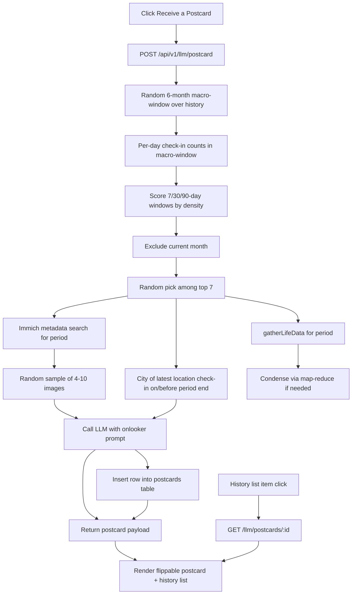

# Postcard From Your Past

A new **Profile → Reflect** feature. A "Receive a Postcard" button in its own
section asks the server for a postcard. The server:

1. Picks an *interesting period* (a burst of activity in the user's past).
2. Picks 4–10 Immich images from that period for the postcard front collage.
3. Stamps the postcard with the city the user was in at the period's end.
4. Asks the LLM (vLLM) for ≤ 2 paragraphs of mindful, friendly prose for the back.
5. **Persists** the postcard to a new `postcards` table so the user can
   re-view it later from a history list.

The client renders a flippable virtual postcard: collage front (with a link to
view the period in Immich), handwritten-style message on the back.

## Data / design decisions

| Concern | Decision |
| --- | --- |
| Interesting period | Server-side. Random 6-month macro-window within `[first check-in, last check-in]`. Within it, count check-ins per day (all plugins via `pluginTimestampUnion`). Score every candidate sub-window of length 7, 30, 90 days (day-aligned, fully inside the macro-window) by **density score `count / sqrt(days)`** — this favors long, sustained activity over short bursts. Exclude any candidate overlapping the **current calendar month**. Randomly pick among the **top 7** scored candidates. |
| Collage images | Immich `/api/search/metadata` for the chosen period (IMAGE type), random sample of 4–10 (or all if fewer). Rendered in the DOM via `immich.thumbnailUrl(assetId, 'preview')` — no download/caching. |
| City stamp | The city of the user's **latest location check-in at or before the period end date** (join `checkins` → `venues`). If no location check-in exists in/near the period, fall back to the user's overall latest location check-in; if none at all, no stamp. |
| Addressed to | `display_name` from `users` (fallback: `username`). |
| From line | `<Display Name>, <period end YYYY-MM>`. |
| Immich link | `${immichUrl}/search?query={takenAfter,takenBefore}` for the exact period (same pattern as [`buildImmichDayUrl`](client/src/components/ReflectTab.tsx:125)). |
| LLM text | Reuses existing LLM settings + chat-completions call. Reuses `gatherLifeData(from, to)` (already in [`llm.ts`](server/src/routes/llm.ts:80)) for the period's check-in data, condensing with the existing map-reduce digest when needed. New system prompt: friendly onlooker in the user's best interest, warm/mindful, **max 2 paragraphs, plain text, no markdown headings**, referencing real places/activities from the data. |
| Persistence | Every received postcard is stored in a new `postcards` table. A history list under the button lets the user re-view any past postcard; "Receive a Postcard" always generates a fresh one. Received postcards are immutable (no text regeneration). |

## Schema

### Migration `server/src/db/migrations/052_postcards.sql`

```sql
CREATE TABLE postcards (
  id           UUID PRIMARY KEY DEFAULT gen_random_uuid(),
  user_id      UUID NOT NULL REFERENCES users(id) ON DELETE CASCADE,
  period_from  DATE NOT NULL,
  period_to    DATE NOT NULL,
  addressed_to TEXT NOT NULL,
  sender_line  TEXT NOT NULL,
  stamp_city   TEXT,
  message      TEXT NOT NULL,
  images       JSONB NOT NULL DEFAULT '[]',  -- [{id, originalFileName, localDateTime}]
  counts       JSONB NOT NULL DEFAULT '{}',
  created_at   TIMESTAMPTZ NOT NULL DEFAULT NOW()
);
CREATE INDEX postcards_user_created_idx ON postcards (user_id, created_at DESC);
```

`images` stores the asset ids **plus the metadata as seen at receive time**
(the Immich asset may be deleted later; the client renders a placeholder tile
for any thumbnail that 404s).

## API

### `POST /api/v1/llm/postcard` (new, in `server/src/routes/llm.ts`)

Request: `{}` (no body params)

Response 200 (postcard payload; persisted before responding):

```json
{
  "id": "…",
  "from": "2024-06-03",
  "to": "2024-07-02",
  "addressed_to": "Zach",
  "sender_line": "Zach, 2024-07",
  "stamp_city": "Lisbon",
  "images": [
    { "id": "…", "originalFileName": "IMG_1234.jpg", "localDateTime": "2024-06-05T…" }
  ],
  "message": "two paragraphs of text…",
  "counts": { "total": 42, "location": 18, "mood": 24 },
  "created_at": "2026-09-30T…"
}
```

Errors: 400 LLM not configured / not enough check-in data; 502 LLM failure;
Immich unconfigured → 200 with `images: []` — postcard still works, front
shows a placeholder.

### History endpoints (new, same router)

- `GET /api/v1/llm/postcards` — list received postcards, newest first:
  `{ id, period_from, period_to, sender_line, stamp_city, message_preview
  (first ~160 chars), image_ids: string[], created_at }[]`.
- `GET /api/v1/llm/postcards/:id` — full postcard payload (same shape as the
  POST response, including `images[]` as captured at receive time).
- `DELETE /api/v1/llm/postcards/:id` — remove a postcard from history.

## Server changes

### 1. New `server/src/services/postcard.ts` (pure, unit-testable)

```ts
/** Score day-aligned windows of given lengths over per-day counts. */
export function scoreWindows(
  dailyCounts: Map<string, number>,        // YYYY-MM-DD -> n
  windowLengths: number[],                 // [7, 30, 90]
  macroFrom: string, macroTo: string,      // 6-month bounds (inclusive)
  excludeFrom: string, excludeTo: string   // current month to exclude
): { from: string; to: string; count: number; score: number }[];
```

- Iterates every start day from `macroFrom` to `macroTo − length + 1`.
- `count` = sum of dailyCounts in the window; skip `count === 0`.
- `score = count / Math.sqrt(length)`.
- Excludes windows overlapping `[excludeFrom, excludeTo]`.
- Returns sorted descending by score.
- Plus `pickRandomTop(candidates, n)` helper (top-7, uniform random pick).
- Plus `randomMacroWindow(first, last, months = 6): { from, to } | null`
  (null when the user's history spans fewer than ~2 months).

The interesting-period algorithm, end to end (route):

```
first,last = earliest/latest check-in dates (earliestDateSources union)
macro      = randomMacroWindow(first, last, 6)          # else: whole history
daily      = per-day counts from pluginTimestampUnion inside macro
cands      = scoreWindows(daily, [7,30,90], macro, currentMonth)
period     = pickRandomTop(cands, 7)
```

If `macro` is null (short history) or fewer than 1 candidate survives the
current-month exclusion, fall back to the single densest window over the whole
history; if still none, 400 "not enough check-in data".

### 2. `server/src/routes/llm.ts` — add `POST /postcard` + history routes

Extract `getLlmSettings` + `callLlm` (and reuse `gatherLifeData`) so the new
route can call them. Minimal refactor: move `getLlmSettings`, `callLlm`,
`LlmSettings` to `server/src/services/llmClient.ts`; import from both routes
(keeps `llm.ts` small and lets tests mock the client).

New `POST /postcard` steps:

1. `getLlmSettings()` → 400 if missing.
2. Compute period (service above).
3. Collage: Immich metadata search for `[from, to]`, IMAGE, size 40; random
   sample of `min(max(images,4)… capped at 10)`. (Immich optional.)
4. Stamp city:
   `SELECT v.city FROM checkins c JOIN venues v ON c.venue_id=v.id
    WHERE c.checked_in_at <= $1::timestamptz AND v.city IS NOT NULL
    ORDER BY c.checked_in_at DESC LIMIT 1` (with `$1 = to + 1 day`).
5. Addressed to: `SELECT display_name, username FROM users WHERE id=$1`.
6. `gatherLifeData(from, to)` → text; reuse the single/map-reduce condensation
   path already in `/summarize` (extract into a small `condenseLifeData(llm, entries)`
   helper shared by both routes, or duplicate the few lines — prefer extracting).
7. `POSTCARD_SYSTEM_PROMPT`: friendly onlooker, best interests, mindful tone,
   ≤ 2 paragraphs, plain text, reference actual places/venues/moods/activities,
   signed off implicitly (the From line is rendered by the client, not LLM).
8. `callLlm(llm, POSTCARD_SYSTEM_PROMPT, header+dataText, maxTokens≈1024)`.
9. **INSERT** row into `postcards` (user_id = `USER_ID`, all fields; `images`
   and `counts` as JSONB), `RETURNING id, created_at`.
10. Respond with the full payload (including `id`, `created_at`).

History routes:

- `GET /postcards` — `SELECT id, period_from, period_to, sender_line,
  stamp_city, LEFT(message, 160) AS message_preview, images, created_at FROM
  postcards WHERE user_id = $1 ORDER BY created_at DESC` (map `images` →
  `image_ids`).
- `GET /postcards/:id` — full row → POST-response shape; 404 if not found.
- `DELETE /postcards/:id` — delete where `id AND user_id`; 404 if not found.

### 3. `server/src/routes/backup.ts`

- Export: add `SELECT id, period_from, period_to, addressed_to, sender_line,
  stamp_city, message, images, counts, created_at FROM postcards WHERE
  user_id = $1 ORDER BY created_at` to the backup payload (new
  `postcards` key, alongside `companions`).
- Import: upsert/insert postcards from the payload (same pattern as
  companions at line ~232).
- Start-over: new option `delete_postcards` (checkbox in
  `StartOverSection`, mirroring `delete_companions`), `DELETE FROM postcards`,
  count in `counts.postcards_deleted`.

## Client changes

### 4. `client/src/api/client.ts`

```ts
export interface PostcardImage { id: string; originalFileName: string; localDateTime: string }
export interface Postcard {
  id?: string;
  from: string; to: string;
  addressed_to: string; sender_line: string;
  stamp_city: string | null;
  images: PostcardImage[];
  message: string;
  counts: Record<string, number>;
  created_at?: string;
}
postcard: () => request<Postcard>('/llm/postcard', { method: 'POST' }),
postcardHistory: () => request<(Postcard & { message_preview: string })[]>('/llm/postcards'),
getPostcard: (id: string) => request<Postcard>(`/llm/postcards/${id}`),
deletePostcard: (id: string) => request<void>(`/llm/postcards/${id}`, { method: 'DELETE' }),
```

### 5. New `client/src/components/PostcardSection.tsx`

Props: `{ llmConfig: LlmConfig; immichUrl: string | null }` (same
`LlmConfig` shape `LifeSummarySection` uses), so it can show the
"configure an LLM" hint when unconfigured.

States: idle (button + history list) → loading ("Composing your postcard…")
→ error → postcard view (current postcard + "Receive another" button +
history list below).

**History list:** on mount, `llm.postcardHistory()` loads past postcards as a
compact list (period range, sender line, stamp city, 1-line preview, first
thumbnail as a small avatar). Clicking an item loads the full postcard via
`llm.getPostcard(id)` into the same flippable card. Each row has a delete
(trash) icon calling `llm.deletePostcard(id)`. The freshly generated postcard
prepends to the list locally (use its `id`/`created_at` from the POST
response).

**Postcard (front):**
- Container with `perspective`, inner card with `transform-style: preserve-3d`
  and a CSS `rotateY(180deg)` flip on click (transition ~700ms). Tailwind + a
  tiny inline `style` for the 3D props; no new dependency.
- Front: classic postcard look (paper background, slight border) — collage
  grid of the 4–10 thumbnails on the left (~2/3 width), right rail with a
  decorative stamp (dashed-border box containing `stamp_city` + small postmark
  circle with `to` date) and a "View this period in Immich ↗" link
  (only when `immichUrl` available). Fallback when no images: a
  gradient/pattern placeholder with the period range.
- Back: "To: <addressed_to>" top-left, "From: <sender_line>" bottom-right,
  stamp top-right, message in a handwriting-feel font stack
  (`font-family: 'Segoe Script', 'Bradley Hand', cursive` fallback) —
  no webfont download.
- Click anywhere on the card (or a "Flip" button) to flip; keyboard-accessible
  (`button` role, `Enter`/`Space`).

Collage layout: `grid` with `auto-fill, minmax(96px, 1fr)`; images
`object-cover`, `aspect-square`, rounded. Max 10 tiles. Broken thumbnail
(404) → placeholder tile.

### 6. `client/src/components/ReflectTab.tsx`

Render `<PostcardSection llmConfig={…} immichUrl={immichUrl} />` in a **new
section between `LifeSummarySection` and the year heatmaps card** (line ~585),
passing the already-loaded `immichUrl` state. No new data fetching in
ReflectTab itself.

### 7. `client/src/pages/settings/StartOverSection.tsx`

Add the `delete_postcards` option (label: "Postcards") so start-over can
clear received postcards; included in the `options` object sent to
`backupApi.startOver`.

## Tests

### 8. Server unit tests — `server/tests/services/postcard.test.ts`

- `scoreWindows`: density ranking favors sustained over bursty;
  zero-count windows skipped; macro bounds respected;
  current-month exclusion works; multiple window lengths coexist.
- `pickRandomTop`: returns element of top-7, never beyond rank 7
  (assert membership).
- `randomMacroWindow`: null when span < ~2 months; result always within
  `[first, last]` and ≈ 6 months long.

### 9. Server integration test — `server/tests/integration/postcard.integration.test.ts`

With a real test DB (pattern from `generic-plugin.integration.test.ts`) and a
mocked LLM client:
- `POST /llm/postcard` inserts a row in `postcards` and returns it.
- 400 when LLM unconfigured.
- `GET /llm/postcards` lists newest-first; `GET /:id` returns full payload;
  `DELETE /:id` removes it; 404 for unknown id.

### 10. Client component test — `client/tests/components/PostcardSection.test.tsx`

- Renders button; shows LLM-not-configured hint when `llmConfig.configured`
  is false.
- On mock API success: renders postcard with addressed-to, sender line,
  stamp city, N `` tags (4–10), Immich link present only when
  `immichUrl` set.
- Click flips the card (message becomes visible).
- Error state renders the API error message; re-pressing retries.
- History: renders list items from a mocked `postcardHistory`; clicking an
  item fetches and shows that postcard; deleting removes the row.

## Out of scope

- Choosing which period or images manually.
- Regenerating text for an already-received postcard (keep as received).
- Actual stamp imagery (decorative text stamp only).
- Multi-user support (single-user app, `DEFAULT_USER_ID` as everywhere).

## File touch list

| File | Change |
| --- | --- |
| `server/src/db/migrations/052_postcards.sql` | new — `postcards` table |
| `server/src/services/llmClient.ts` | new — extracted `getLlmSettings`, `callLlm`, `LlmSettings` |
| `server/src/services/postcard.ts` | new — pure window-scoring/picking helpers |
| `server/src/routes/llm.ts` | import extracted helpers; add `POST /postcard` (persist), `GET /postcards`, `GET /postcards/:id`, `DELETE /postcards/:id`; extract shared condensation |
| `server/src/routes/backup.ts` | export/import `postcards`; start-over `delete_postcards` |
| `server/tests/services/postcard.test.ts` | new |
| `server/tests/integration/postcard.integration.test.ts` | new |
| `client/src/api/client.ts` | add `llm.postcard()`, `postcardHistory()`, `getPostcard()`, `deletePostcard()` |
| `client/src/components/PostcardSection.tsx` | new (postcard + history list) |
| `client/src/components/ReflectTab.tsx` | render `PostcardSection` in new section |
| `client/src/pages/settings/StartOverSection.tsx` | add `delete_postcards` option |
| `client/tests/components/PostcardSection.test.tsx` | new |

## Flow


