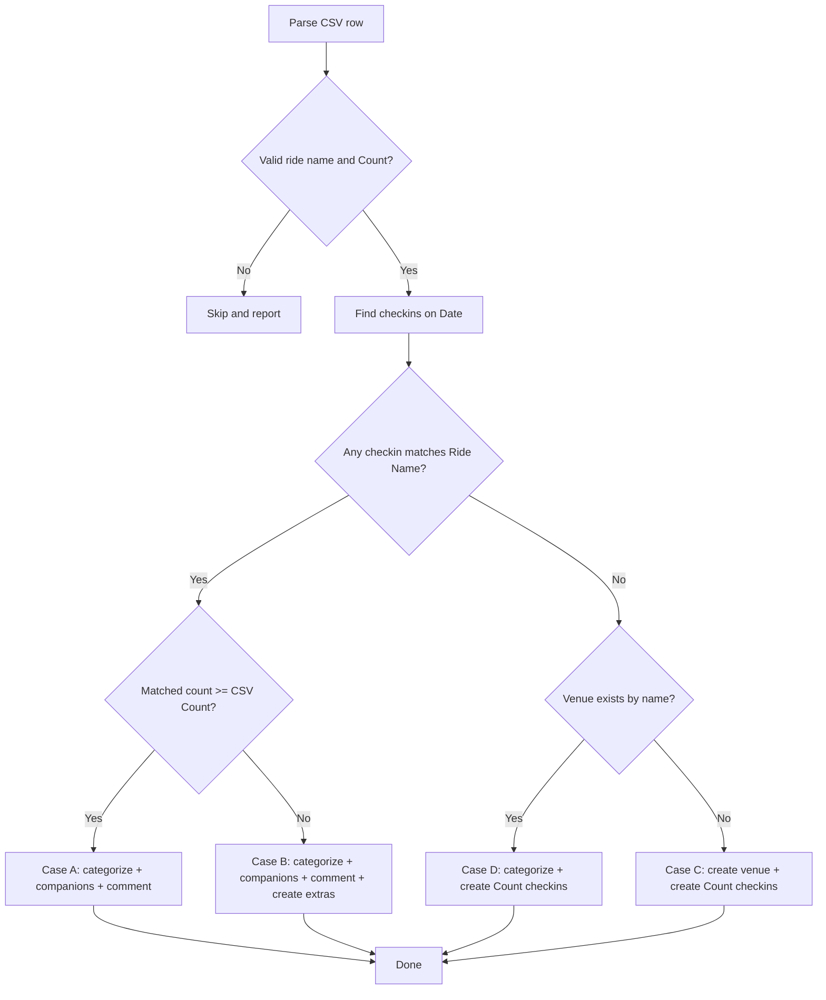

# Ride Log Import — One-off Script

## Goal

Import `My Amusement Park Rides - Ride Log.csv` into the location check-in history. For each row, find or create check-ins on the listed date at the named ride venue, associate companions, add comments, and categorize the venue as "Amusement Ride".

## CSV Columns

| Column | Description |
|--------|-------------|
| `Date` | `YYYY-MM-DD` — the date of the ride |
| `Ride Name` | The ride/attraction name (matches venue `name`) |
| `Park` | The amusement park (used for venue coordinates when creating new venues) |
| `Count` | How many check-ins this ride should have on that date |
| `Rode With` | Comma-separated companion names (`--` = none, empty = none) |
| `Comments` | Free-text note (may span multiple lines) |

## Decision Matrix

| Existing checkin match on date? | Venue exists by name? | Action |
|--------------------------------|----------------------|--------|
| Yes, count ≥ CSV Count | (n/a) | **Case A** — categorize + companions + comment only |
| Yes, count < CSV Count | (n/a) | **Case B** — categorize + companions + comment + create extra checkins |
| No | Yes | **Case D** — create Count new checkins at existing venue |
| No | No | **Case C** — create new venue + Count new checkins |

### Case A — Sufficient existing check-ins
1. Set venue `category_id` to "Amusement Ride" (create category if missing).
2. `insertCompanions('location', checkinId, names)` for each existing matched check-in (idempotent via `ON CONFLICT DO NOTHING`).
3. If `Comments` is non-empty: find the earliest matched check-in on that date with `notes IS NULL` or `notes = ''`, set its `notes` to the comment text. If all already have notes, skip.

### Case B — Insufficient existing check-ins
1–3. Same as Case A.
4. Create `(Count − existingCount)` new check-ins at the venue:
   - `checked_in_at` = **noon local time** on the date (converted via the venue's IANA timezone)
   - `checkin_timezone` = venue's IANA timezone (inferred from coordinates via `getVenueTimezone`)
   - `notes` = NULL (the comment goes on an existing check-in per step 3)
   - Companions added to each new check-in
   - Inserted in sequence so they appear "immediately after" the last existing check-in

### Case C — No checkin match, venue does NOT exist
1. Look up the park venue in the DB (normalize `Park` name, match against venues). Use the park's `latitude`/`longitude` for the new ride venue. If no park venue found, geocode via Nominatim (`searchPlacesByName`).
2. `INSERT INTO venues (name, category_id, latitude, longitude)` with the ride name, "Amusement Ride" category, and park coordinates.
3. Create `Count` new check-ins at noon on the date at the new venue, with companions.
4. Set `notes` = comment text on the first new check-in (if comment is non-empty).

### Case D — No checkin match, venue DOES exist
1. Find the venue by name (canonical duplicate — see below).
2. Set venue `category_id` to "Amusement Ride".
3. Create `Count` new check-ins at noon on the date at the venue, with companions.
4. Set `notes` = comment text on the first new check-in (if comment is non-empty).

## Name Matching

Three-tier normalization (same pattern as `import-ride-ratings.ts`, plus "The" stripping):

1. **`normalizeName`**: NFKC → lowercase → straight quotes → collapse whitespace → **strip leading/trailing "The "** (word boundary, e.g. "The Beast" → "beast", "Beast" → "beast")
2. **`looseKey`**: `normalizeName` → remove all non-alphanumeric characters (e.g. "King's Island" → "kingsisland", "Kings Island" → "kingsisland")
3. Match: exact `normalizeName` first, then `looseKey` fallback

This handles:
- `Beast` ↔ `The Beast` (The-stripping)
- `King's Island` ↔ `Kings Island` (loose key)
- `SUPERMAN: Ultimate Flight` ↔ `Superman Ultimate Flight` (loose key)
- `Takabisha (高飛車)` ↔ `Takabisha` (loose key strips CJK parens + content)

### Known limitation
- `Millennium Force` (CSV, 2 L's) vs `Millenium Force` (DB, 1 L) — these are **different** strings even after normalization. The script will treat this as "venue doesn't exist" and create a new venue. The dry-run will surface this for the user to review.

## Duplicate Venue Rows

The DB contains **2 identical venue rows** per place (e.g. two `Maverick` rows at the same coordinates). When multiple rows match a name:

- **Canonical selection**: pick the row with the most check-ins (`COUNT(*) FROM checkins WHERE venue_id = ...`). Ties broken by earliest `created_at`.
- All check-ins for a row are attributed to the canonical venue.
- Category updates are applied to **all** matching rows (to keep duplicates consistent, same as `import-ride-ratings.ts`).

## New Check-in Timestamp

"noon on the date" in the venue's local timezone, stored as `timestamptz` (UTC internally).

**SQL approach** (let PostgreSQL handle DST):
```sql
INSERT INTO checkins (user_id, venue_id, notes, checked_in_at, checkin_timezone)
VALUES ($1, $2, $3,
        TO_TIMESTAMP($4 || ' 12:00:00', 'YYYY-MM-DD HH24:MI:SS') AT TIME ZONE $5,
        $5)
```
Where `$4` = date string, `$5` = IANA timezone (e.g. `America/New_York`).

## "First Check-in on that Date" for Comments

- **Cases A/B**: the earliest matched ride check-in on that date where `notes IS NULL OR TRIM(notes) = ''`. If all have notes, skip.
- **Cases C/D**: the first newly created check-in (the one inserted first, i.e. earliest `checked_in_at`).

## Companion Parsing

- Split `Rode With` by comma, trim each token.
- Drop empty strings and the literal `--`.
- Pass through `normalizeCompanions()` (case-insensitive dedupe).
- `Rode With = --` or empty → no companions.

## Row Skipping Rules

- `Ride Name = *VARIOUS RIDES*` (or any name starting with `*`) → **skip**, report as un-importable.
- `Count` missing or non-numeric → **skip**, report.
- `Count < 1` → **skip**, report.

## Files to Create / Modify

| File | Action | Purpose |
|------|--------|---------|
| `plugins/location/scripts/import-ride-log.ts` | **Create** | The one-off import script (dry-run + real) |
| `server/package.json` | **Modify** | Add `"import:ride-log": "tsx ../plugins/location/scripts/import-ride-log.ts"` |
| `server/tsconfig.json` | **Modify** | Add `"../plugins/location/scripts/import-ride-log.ts"` to `include` |
| `scripts/run-import-ride-log.sh` | **Create** | Docker wrapper (same pattern as `run-import-ride-ratings.sh`) |

## Script Structure (`import-ride-log.ts`)

```
1. Imports
   - fs, path, os, csv-parse/sync
   - pool from server/src/db
   - insertCompanions, normalizeCompanions from server/src/services/companions
   - getVenueTimezone from plugins/location/services/geoTimezone
   - DEFAULT_USER_ID from server/src/constants

2. Constants
   - DEFAULT_CSV path
   - RIDE_CATEGORY = 'Amusement Ride'

3. CSV Parsing
   - parseRideLogCsv(csv) → RideLogRow[]
   - Handle multi-line Comments (csv-parse handles quoted newlines)
   - Parse: date, rideName, park, count, companions[], comment

4. Name Normalization
   - normalizeName(name) → NFKC + lower + quotes + whitespace + strip "the"
   - looseKey(name) → normalizeName + remove non-alphanumeric

5. Load Local State
   - loadVenues() → { byExact, byLoose, all } (in-memory index)
   - loadCheckinsForDates(dates: string[]) → checkins grouped by local date
     - Query: all checkins where (checked_in_at AT TIME ZONE coalesce(checkin_timezone,'UTC'))::date IN (...)
     - Join venues for name, lat, lng
     - Order by checked_in_at

6. Park Lookup
   - findParkVenue(parkName, venues) → venue with coordinates (for new ride venues)
   - Fallback: geocode via Nominatim searchPlacesByName

7. Canonical Venue Selection
   - pickCanonicalVenue(venues: LocalVenue[]) → the one with most checkins

8. Matching
   - matchRideCheckins(row, checkinsByDate, venues) → MatchResult
     - Find checkins on the date whose venue name matches the ride name
     - Returns: matched checkins, canonical venue, count

9. Dry Run (read-only)
   - runDryRun(rows) → print per-row plan + summary
   - No writes

10. Import (write, single transaction)
    - runImport(rows)
    - BEGIN
    - Ensure "Amusement Ride" category exists
    - For each row (in CSV order):
      - Determine case (A/B/C/D)
      - Apply changes
    - COMMIT / ROLLBACK on error

11. Main
    - Parse args: --dry-run, csv path
    - Read CSV, parse, dispatch
    - pool.end()
```

## Dry Run Output Format

```
Parsed 133 ride log rows from /app/data/rides.csv

=== DRY RUN — no writes will be made ===
Category "Amusement Ride": would be created

  ✓ line 2: Millennium Force (2010-07-13) — NO existing checkins
    venue: NOT FOUND → will create new venue at Cedar Point coords
    will create: 1 checkin(s) at 12:00 local
    companions: Taylor, Cait, Maegan
    comment: "A classic."

  ✓ line 5: Top Thrill Dragster (2010-07-13) — 0 existing checkins, need 2
    venue: "Top Thrill Dragster" (Sandusky, US) [id...]
    will create: 2 checkin(s) at 12:00 local
    companions: Taylor, Cait, Maegan
    comment: "A classic."

  ✓ line 75: Medusa (2017-04-24) — 2 existing checkins, need 2 → Case A
    venue: "Medusa" (Vallejo, US) [id...]
    companions: Dani (2 checkins)
    comment: none (empty)

  ✗ line 103: *VARIOUS RIDES* (2019-09-21) — skipped (placeholder ride name)

=== DRY RUN SUMMARY ===
  rows processed:        132
  rows skipped:           1
  case A (enough):        N
  case B (need more):     N
  case C (new venue):     N
  case D (existing venue): N
  checkins to create:     N
  venues to categorize:   N
  venues to create:       N
  companions to add:      N
  comments to add:        N
```

## Docker / Production

Same pattern as `run-import-ride-ratings.sh`:

```bash
# Dry run
./scripts/run-import-ride-log.sh --dry-run "/app/data/My Amusement Park Rides - Ride Log.csv"

# Apply
./scripts/run-import-ride-log.sh "/app/data/My Amusement Park Rides - Ride Log.csv"
```

The CSV must be in `./data/server/` on the host (mounted as `/app/data/` in the container).

## Mermaid: Per-Row Decision Flow



## Reuses From Existing Code

| What | From | How |
|------|------|-----|
| DB pool | [`server/src/db/index.ts`](server/src/db/index.ts:1) | `import { pool } from '../../../server/src/db'` |
| Companion insert | [`server/src/services/companions.ts`](server/src/services/companions.ts:101) | `insertCompanions('location', id, names, client)` |
| Companion normalize | [`server/src/services/companions.ts`](server/src/services/companions.ts:40) | `normalizeCompanions(string[])` |
| Timezone inference | [`plugins/location/services/geoTimezone.ts`](plugins/location/services/geoTimezone.ts:21) | `getVenueTimezone(lat, lng)` |
| Name normalization | [`plugins/location/scripts/import-ride-ratings.ts`](plugins/location/scripts/import-ride-ratings.ts) | `normalizeName`, `looseKey` (copy + extend with "The" stripping) |
| CSV parsing pattern | [`plugins/media/scripts/import-games-csv.ts`](plugins/media/scripts/import-games-csv.ts:91) | `csv-parse/sync` with `columns: true, bom: true` |
| Docker wrapper | [`scripts/run-import-ride-ratings.sh`](scripts/run-import-ride-ratings.sh:1) | Same structure, different script path |
| User ID | [`server/src/constants.ts`](server/src/constants.ts:8) | `DEFAULT_USER_ID` |
