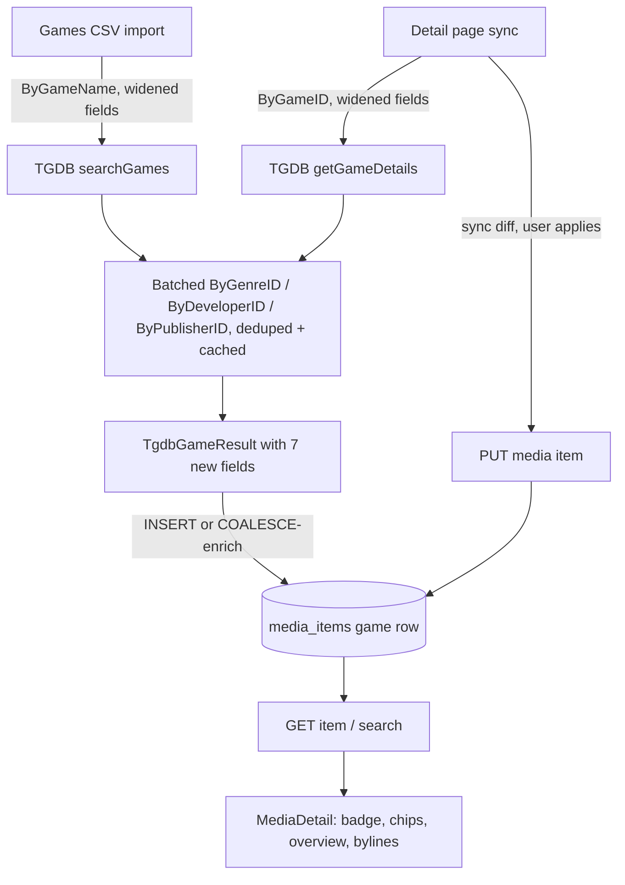

# TGDB Game Metadata Import — Architecture & Plan

## 1. Goal

Import 7 additional game metadata fields from TheGamesDB onto `media_items` (game rows only) and display them on the game media item detail page.

## 2. Field set (confirmed with user)

| TGDB field | New column | Type | Source | Notes |
|---|---|---|---|---|
| `overview` | `overview` | `TEXT` | base `Game` payload | Synopsis paragraph |
| `genres[]` | `genres` | `TEXT[]` | id array → `/v1/Genres/ByGenreID` | Displayed as chips |
| `developers[]` | `developers` | `TEXT[]` | id array → `/v1/Developers/ByDeveloperID` | |
| `publishers[]` | `publishers` | `TEXT[]` | id array → `/v1/Publishers/ByPublisherID` | |
| `rating` (ESRB) | `content_rating` | `TEXT` | base `Game` payload | **Renamed** to avoid collision with user `rating SMALLINT` (migration 040). Displayed as a badge |
| `players` | `players` | `INT` | base `Game` payload | Min player count |
| `coop` | `coop` | `TEXT` | base `Game` payload | `"Yes"`/`"No"`/other; only display when not null |

Rejected (with rationale): `os`/`processor`/`ram`/`hdd`/`video`/`sound` (PC system-reqs, mostly NULL for console games), `youtube` (bare video id, no guaranteed embed), `region_id`/`country_id` (extra lookups, marginal display value), `alternates` (matching concern, not display), `last_updated` (housekeeping).

All columns are nullable and apply only to `media_type = 'game'` rows (books/movies keep their own fields).

## 3. API cost analysis (monthly TGDB allowance)

- `overview`, `content_rating`, `players`, `coop` are **free**: they ride on the same `ByGameName`/`ByGameID` call — just widen `fields=`.
- `genres`/`developers`/`publishers` arrive as id arrays and need name resolution. Strategy:
  - **One batched `By*ID` call per distinct id-set per category** (the endpoints accept comma-delimited ids: `?id=1,8`).
  - **Dedupe ids across the whole import run** (single in-memory `Map<number,string>` + `ApiCache`) so a 200-game import costs at most a handful of extra calls (genre list is small and stable; developer/publisher ids mostly repeat).
  - Unknown ids (TGDB data gaps) resolve to nothing and are dropped silently; a game whose genre list can't be resolved gets `NULL` for that array, not a partial guess.
  - `searchGames` (used by the CSV import) resolves names for all returned candidates in the same batched pass before `pickBestTgdbMatch` picks a winner — no extra calls.
  - `getGameDetails` (detail-page sync) does the same single-game version.

## 4. Schema — migration `041_media_items_tgdb_metadata.sql`

```sql
ALTER TABLE media_items
  ADD COLUMN IF NOT EXISTS overview TEXT,
  ADD COLUMN IF NOT EXISTS content_rating TEXT,
  ADD COLUMN IF NOT EXISTS players INT CHECK (players IS NULL OR players > 0),
  ADD COLUMN IF NOT EXISTS coop TEXT,
  ADD COLUMN IF NOT EXISTS genres TEXT[],
  ADD COLUMN IF NOT EXISTS developers TEXT[],
  ADD COLUMN IF NOT EXISTS publishers TEXT[];
```

No backfill (games already imported are enriched by re-running the CSV import or the detail-page sync, consistent with the existing "re-enrich local-only items" pattern). `TEXT[]` over comma-separated TEXT: PG-native, cheap `GIN` if needed later, and JSON-serialized as an array over the API which the client already handles for other array shapes.

## 5. Server changes

### 5.1 [`services/tgdb.ts`](server/src/services/tgdb.ts)
- Extend `TgdbGameRow` with `overview?`, `players?`, `rating?` (ESRB string), `coop?`, `genres?: number[]`, `developers?: number[]`, `publishers?: number[]`.
- Widen both request URLs: `fields=platform,overview,players,rating,coop` (keep `include=boxart,platform`).
- Extend `TgdbGameResult` with `overview: string | null`, `players: number | null`, `contentRating: string | null`, `coop: string | null`, `genres: string[] | null`, `developers: string[] | null`, `publishers: string[] | null`.
- Add `resolveNames(apiKey, kind, ids)` helper → batched `/v1/{Genres,Developers,Publishers}/By{Genre,Developer,Publisher}ID?id=a,b` call, results cached in `ApiCache` per id (long TTL; these catalogs barely change), unknown ids dropped.
- `searchGames`: after dedupe, collect all genre/developer/publisher ids across the candidate rows, resolve in up to 3 batched calls, then map rows.
- `getGameDetails`: same for the single row.

### 5.2 [`db/import-games-csv.ts`](server/src/db/import-games-csv.ts)
- **Insert branch** (line ~510): add the 7 columns to the `INSERT` (values from `match`, or `NULL` for local-only rows).
- **Enrichment branch** (line ~487): `COALESCE` each new column so a re-run never clobbers a NULL with… actually the opposite — enrichment currently fills nulls only; keep that: `overview = COALESCE(overview, $n)` etc. If TGDB data was NULL at first import, re-running enriches it.
- The name-resolution calls happen inside `lookupGames` (already sequential/delayed/degrading), so the batched `By*ID` calls inherit the same failure handling.
- Stats: no new counters needed; the per-line log line is unchanged.

### 5.3 [`routes/media.ts`](server/src/routes/media.ts)
- `GET /media/items/:id`, `GET /media/search`, and any other item serializer: include the 7 new fields (plain pass-through; `null` for non-game rows).
- `PUT /media/items/:id`: **accept** `overview`, `content_rating`, `players`, `coop` (scalars, null-able) so the detail-page sync "apply diff" can write them. `genres`/`developers`/`publishers` are array-valued — accept as string[] with per-element length limits. Validation: `players` positive int; `overview`/`content_rating`/`coop` string-or-null; arrays of short strings.
- `POST /media/items/:id/sync` (the `syncItem` endpoint used by the detail page): the game branch calls `getGameDetails` — it now automatically carries the new fields into `res.metadata` and applies them to the row when the user accepts.

### 5.4 [`routes/backup.ts`](server/src/routes/backup.ts)
- Export: add the 7 columns to the `media_items` SELECT (line ~464) and the exported row interface (line ~174).
- Restore: add to the INSERT column list (line ~1042) with `toStringOrNull`/`toIntOrNull` for scalars and a small `toStringArrayOrNull` helper (JSON array in → PG array literal) for the three `TEXT[]` columns.

## 6. Client changes

- [`types/index.ts`](client/src/types/index.ts): `MediaItem` gains `overview: string | null`, `content_rating: string | null`, `players: number | null`, `coop: string | null`, `genres: string[] | null`, `developers: string[] | null`, `publishers: string[] | null`.
- [`MediaDetail.tsx`](client/src/pages/media/MediaDetail.tsx) — display, game subtype only:
  - Header meta row (next to `release_year`/`platform` at line ~840): `content_rating` as a small badge, `players` ("1 player"/"N+ players"), `coop` shown only when value is `Yes`/truthy ("Co-op").
  - `genres` rendered as chips (reusing the existing chip styling from filters).
  - `developers`/`publishers` as secondary "Developed by … / Published by …" lines.
  - `overview` as a description paragraph below the header block.
  - All blocks conditional on non-empty values so non-game rows and unenriched local-only games render unchanged.
- Edit mode: **not** editable — these are provider-sourced (same as `image_url` today is provider-synced but editable; the 7 new fields follow the sync-only path to avoid hand-editing provider data). `buildSyncDiff` (line ~417) gains entries for the new fields so "Sync from TheGamesDB" shows diffs and the apply action writes them via `PUT`.
- [`MediaLibrarySection.tsx`](client/src/components/MediaLibrarySection.tsx) / [`MediaSearch.tsx`](client/src/pages/media/MediaSearch.tsx): no change (card layout stays as-is; detail page is where the new metadata lives).

## 7. Mermaid: import + sync data flow



## 8. Test plan

- **`services/tgdb` unit tests**: widened `fields=` in request URLs; field mapping for `overview`/`players`/`rating`→`contentRating`/`coop`; batched name resolution (single call for multiple ids, cache hit on repeat, unknown ids dropped, null array when a category fully fails); `searchGames` and `getGameDetails` both carry the new fields.
- **Import tests** (extend the games-CSV test suite): new columns written on INSERT; enrichment uses COALESCE (existing non-null kept, NULL filled on re-run); local-only rows stay NULL.
- **`media` integration tests**: GET item/search include the 7 fields; PUT validation (bad `players`, oversized array); sync endpoint returns new fields in `metadata` and applies them.
- **Backup roundtrip test**: new columns survive export → restore, including `TEXT[]` values and all-NULL rows.
- **Client tests**: `MediaDetail` renders badge/chips/overview/bylines for a game with the fields, renders nothing extra when all are null; sync diff lists a changed `overview`.
